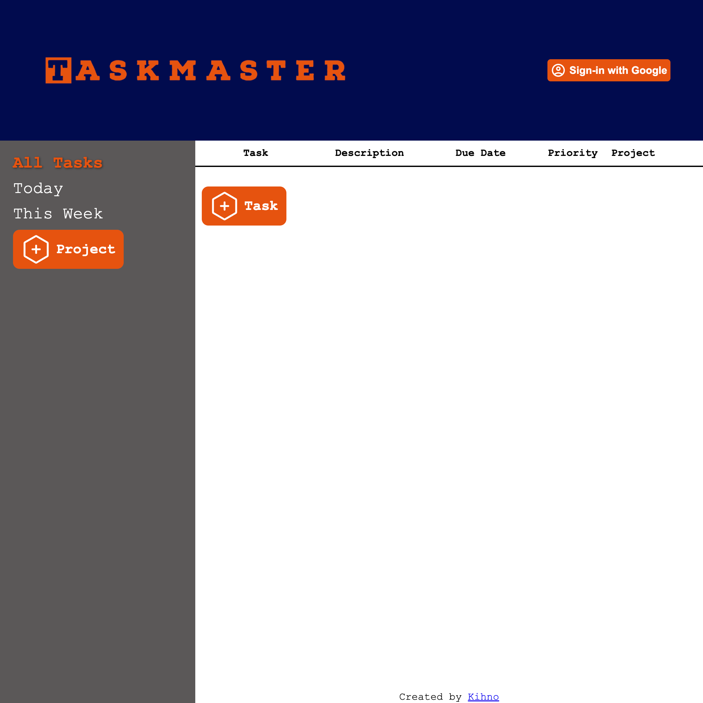

# Taskmaster

https://kihno.github.io/todo-app/

## Description

A todo-list app built with a firebase back-end and Google sign-in authentication.

## Built With

- React
- Firebase

## Features

- Add todo tasks
- View taks due daily and weekly
- Create projects to store grouped tasks together
- Sign-in with Google to save and access your todo list from anywhere.

## Acknowledgements

Built as part of [The Odin Project](https://www.theodinproject.com/) full stack curriculm.